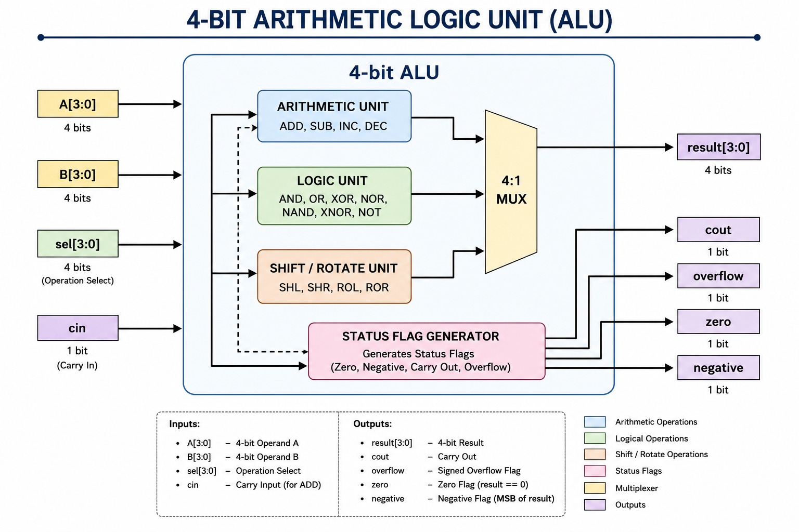

This project implements a **4-bit Arithmetic Logic Unit (ALU)** in **Verilog HDL**. The design is fully combinational and is simulated and verified using **Icarus Verilog** with a self-checking testbench, without any physical hardware.

## Overview

An ALU is the core computational block inside any processor or datapath, responsible for performing arithmetic, logical, and shift/rotate operations on binary data.
This project models a 4-bit ALU that supports:

- Arithmetic operations (ADD, SUB, INC, DEC)
- Logical operations (AND, OR, XOR, NOR, NAND, XNOR, NOT)
- Shift and rotate operations (SHL, SHR, ROL, ROR)
- Pass-through operation (PASS A)

Each operation is selected using a 4-bit opcode (`sel`), and the ALU produces a 4-bit result along with status flags.

---

## Core Idea

- Fully combinational design (no clock)
- 4-bit opcode (`sel`) selects 1 of 16 operations
- Status flags generated alongside the result: `cout`, `zero`, `negative`, `overflow`
- Separate testbench used for verification, with a single unified check task validating result + all flags together

## Tools Used

- Verilog HDL
- EDA playground

## Project Structure

```
src/         -> RTL design (alu_4bit.v)
tb/          -> Testbench (alu_4bit_tb.v)
docs/        -> ALU block diagram
simulation/  -> Simulation waveform and log output
```

---

## Opcode Table

| sel  | Operation | sel  | Operation |
|------|-----------|------|-----------|
| 0000 | ADD       | 1000 | NOT       |
| 0001 | SUB       | 1001 | SHL       |
| 0010 | AND       | 1010 | SHR       |
| 0011 | OR        | 1011 | ROL       |
| 0100 | XOR       | 1100 | ROR       |
| 0101 | NOR       | 1101 | INC       |
| 0110 | NAND      | 1110 | DEC       |
| 0111 | XNOR      | 1111 | PASS A    |

---

## Simulation Results

The design was verified using Icarus Verilog simulation with 21 directed test cases covering every operation and key status-flag conditions.
The output confirms:

- Correct result for every arithmetic, logical, and shift/rotate operation
- Correct carry-out (`cout`) behavior for addition, subtraction, and shifts
- Correct `zero`, `negative`, and signed `overflow` flag generation
- All 21/21 test cases passed

### Block Diagram



### Simulation Waveform


- FSM-based control and arithmetic units
- Learning RTL design and verification

---

## Future Enhancements

- Parameterizable bit-width (8-bit, 16-bit, 32-bit ALU)
- Additional flags (parity, half-carry)
- FPGA board implementation
- Synthesis and gate-level verification (Synopsys Design Compiler)


## Author

Khushi Shah
